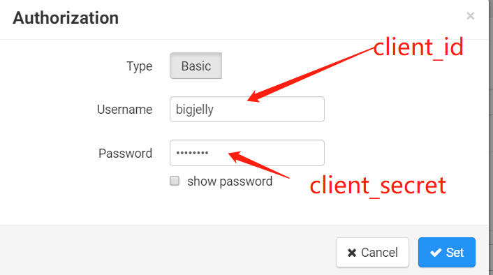
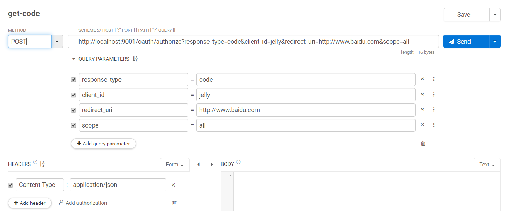
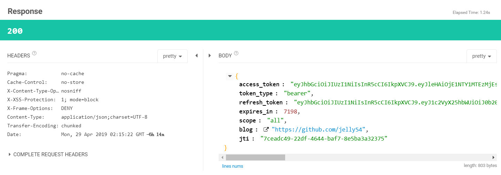
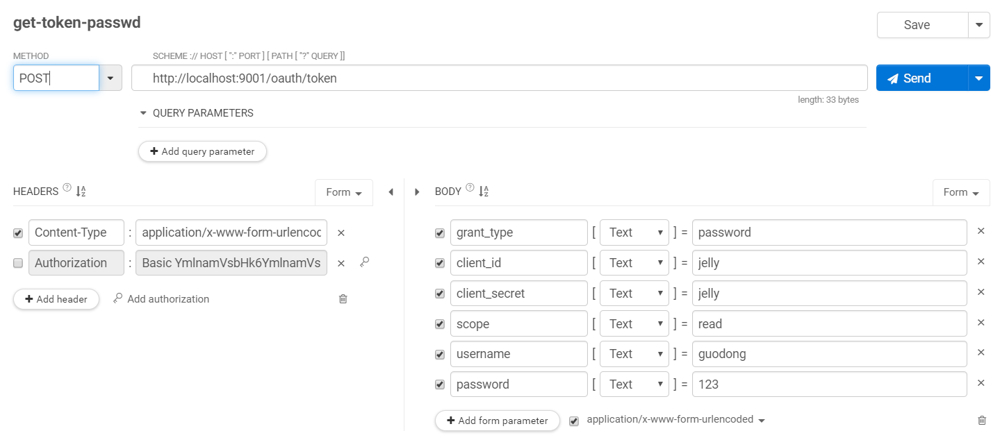
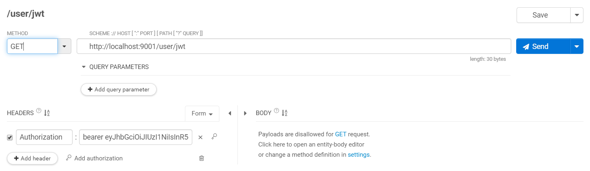
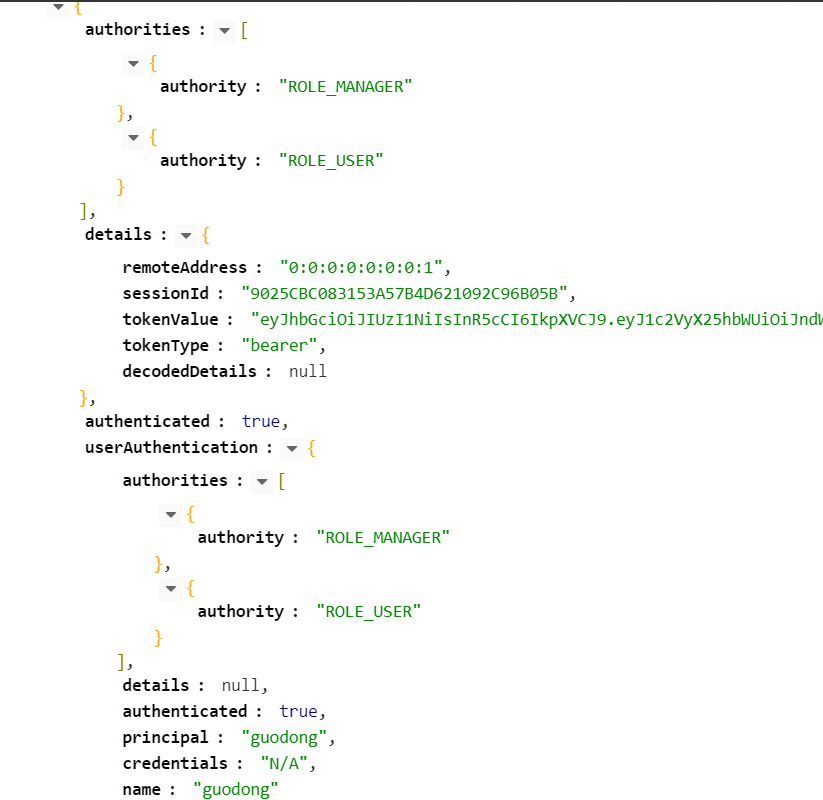

# Spring Boot OAuth2 Getting Started

### Guides

* 运行项目中 [sql文件](./src/main/resources/db) 获取数据库

* 基础文件
    - [bean](./src/main/java/com/jelly/oauth2demo/bean)  pojo 的包路径
    - [dao](./src/main/java/com/jelly/oauth2demo/dao)  mapper&操作数据库的sql 的包路径
    - [service](./src/main/java/com/jelly/oauth2demo/service)  service服务的包路径
    - [controller](./src/main/java/com/jelly/oauth2demo/controller)  相关控制器的包路径

* 在 [authorization](src/main/java/com/jelly/oauth2demo/authorization) 下是 spring security oauth2的配置文件，
    - [config/TokenStoreConfig](src/main/java/com/jelly/oauth2demo/authorization/config/TokenStoreConfig.java) token存储到哪里，根据配置文件使用jwt 或者 redis
    - [security/jwt](src/main/java/com/jelly/oauth2demo/authorization/security/jwt) 可以自定义向Token中添加数据
    - [security/SecurityConfig](src/main/java/com/jelly/oauth2demo/authorization/security/SecurityConfig.java) web security 配置，处于过滤器的第一层
    - [server/MyAuthorizationServerConfig](src/main/java/com/jelly/oauth2demo/authorization/server/MyAuthorizationServerConfig.java) 授权中心，配置服务器端点信息，授权的方式，客户端注册等
    - [server/MyResourceServerConfig](src/main/java/com/jelly/oauth2demo/authorization/server/MyResourceServerConfig.java) 资源服务器配置，配置访问资源的方式（httpBasic、formLogin）。配置可以不经授权就访问的资源。
    - [server/handler](src/main/java/com/jelly/oauth2demo/authorization/server/handler) form 表单登录，失败& 成功后处理器
* 在[properties](src/main/java/com/jelly/oauth2demo/authorization/properties) OAuth2的properties文件，从主配置文件中读取（ application.yaml)


** 注意事项 **  
 在[MyAuthorizationServerConfig](src/main/java/com/jelly/oauth2demo/authorization/server/MyAuthorizationServerConfig.java) 授权表达式中。如果不配置第三个 允许客户端表单认证，则必须在请求header中加入


流程：
```
AuthorizationServerSecurityConfigurer : configure(HttpSecurity http) --允许从form读取客户端--> (新增一个过滤器) clientCredentialsTokenEndpointFilter --> (当新的请求过来的额时候，进入该过滤器) attemptAuthentication ------>  AbstractUserDetailsAuthenticationProvider :(校验用户名密码)authenticate --->DaoAuthenticationProvider : retrieveUser -->  ClientDetailsUserDetailsService : loadUserByUsername
                                                |                                                                                                                                                                          |                                 
                                                  --未配置--->  读取内存中的用户名密码，即第一次根据code-获取token的测试，在弹窗中输入的用户名密码。所以不会通过，于是又弹出一个弹框，此时输入client_id 和 client_secert  |
```                                                  
                 
###  亲手测试一下
 我是用的时chrome的一个插件，类似于postman。CLIENT。相关 [配置文件](src/main/resources/db/security-oauth2.json) 在这里

* code-token模式。先获取code，通过code获取token  

1、先获取code
                                                 
   
 返回结果 
      
 
2、 通过code获取token
        
   
 返回结果 
      
 

* password模式。通过用户名，密码获取token 

     
    
 返回结果 
      
  
 
* refresh-token模式。通过获取token时的refresh-token获取新的token

     
    
 返回结果 
      
  
  
* 查询当前账户。

     
    
 返回结果 
      
                                       
